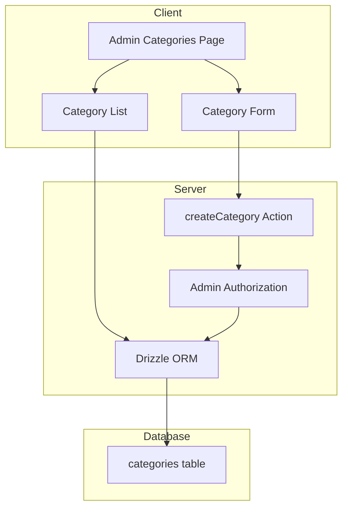
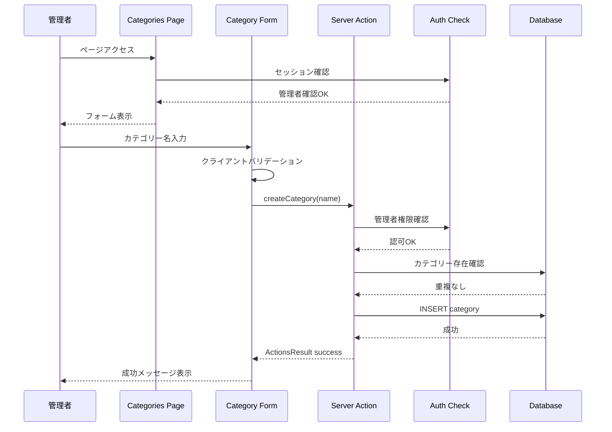

# Design Document

## Overview

**Purpose**: この機能は管理者がシステム内でカテゴリーを追加・管理できるようにする。
**Users**: 管理者ユーザーがコンテンツの分類整理のためにこの機能を使用する。
**Impact**: 管理者向けの新しいカテゴリー管理ページを追加する。

### Goals

- 管理者がカテゴリーを追加できる
- 既存のカテゴリー一覧を表示できる
- 管理者以外のアクセスを制限する

### Non-Goals

- カテゴリーの編集・削除機能（将来の拡張）
- カテゴリーの階層構造（将来の拡張）
- カテゴリーの並び替え機能

## Architecture

### Existing Architecture Analysis

現在のシステムは以下のパターンを採用している:

- Next.js App Router によるルーティング
- Server Actions によるデータ操作
- Drizzle ORM + SQLite によるデータ永続化
- NextAuth v5 (JWT戦略) による認証・認可
- @base-ui/react + CSS Modules によるUI構築

### Architecture Pattern & Boundary Map



**Architecture Integration**:

- Selected pattern: Server Actions パターン（既存と一致）
- Domain/feature boundaries: admin ドメイン配下に配置
- Existing patterns preserved: ActionsResult, Zod validation, react-hook-form
- New components rationale: カテゴリー管理専用のページとフォームコンポーネント
- Steering compliance: 既存のコーディングパターンを踏襲

### Technology Stack

| Layer          | Choice / Version       | Role in Feature      | Notes        |
| -------------- | ---------------------- | -------------------- | ------------ |
| Frontend       | Next.js 14.2.5         | App Router ページ    | 既存         |
| UI Components  | @base-ui/react         | フォーム・レイアウト | 既存         |
| Form Handling  | react-hook-form + zod  | バリデーション       | 既存         |
| Backend        | Next.js Server Actions | カテゴリー作成処理   | 既存パターン |
| Data / Storage | Drizzle ORM + SQLite   | categories テーブル  | 既存         |
| Authentication | NextAuth v5            | 管理者認可           | 既存         |

## System Flows

### カテゴリー作成フロー



## Requirements Traceability

| Requirement | Summary                        | Components                   | Interfaces            | Flows                |
| ----------- | ------------------------------ | ---------------------------- | --------------------- | -------------------- |
| 1.1         | カテゴリー作成と成功メッセージ | CategoryForm, createCategory | createCategory Action | カテゴリー作成フロー |
| 1.2         | カテゴリー名必須               | CategoryForm                 | CategoryFormSchema    | -                    |
| 1.3         | 空名バリデーション             | CategoryForm                 | CategoryFormSchema    | -                    |
| 1.4         | 重複チェック                   | createCategory               | createCategory Action | カテゴリー作成フロー |
| 1.5         | カテゴリー保存                 | createCategory               | Drizzle categories    | カテゴリー作成フロー |
| 2.1         | カテゴリー一覧表示             | CategoryList, getCategories  | getCategories DB      | -                    |
| 2.2         | 名前・作成日表示               | CategoryList                 | Category type         | -                    |
| 2.3         | 空状態表示                     | CategoryList                 | -                     | -                    |
| 3.1         | 非管理者アクセス拒否           | AdminCategoriesPage          | Auth middleware       | -                    |
| 3.2         | 未認証リダイレクト             | AdminCategoriesPage          | Auth middleware       | -                    |
| 3.3         | 管理者UI表示                   | AdminCategoriesPage          | -                     | -                    |
| 4.1         | フォーム提供                   | CategoryForm                 | -                     | -                    |
| 4.2         | 送信時バリデーション           | CategoryForm                 | CategoryFormSchema    | -                    |
| 4.3         | ローディング表示               | CategoryForm                 | -                     | -                    |
| 4.4         | エラー表示・再試行             | CategoryForm                 | ActionsResult         | -                    |

## Components and Interfaces

| Component           | Domain/Layer        | Intent                 | Req Coverage       | Key Dependencies                          | Contracts    |
| ------------------- | ------------------- | ---------------------- | ------------------ | ----------------------------------------- | ------------ |
| AdminCategoriesPage | Pages/Admin         | カテゴリー管理ページ   | 2.1, 3.1, 3.2, 3.3 | getSession (P0), getCategories (P0)       | -            |
| CategoryForm        | Components/Forms    | カテゴリー作成フォーム | 1.1-1.4, 4.1-4.4   | createCategory (P0), react-hook-form (P1) | Service      |
| CategoryList        | Components/Elements | カテゴリー一覧表示     | 2.1-2.3            | -                                         | -            |
| createCategory      | Actions             | カテゴリー作成処理     | 1.1, 1.4, 1.5      | getSession (P0), db (P0)                  | Service, API |
| getCategories       | DB Functions        | カテゴリー取得         | 2.1                | db (P0)                                   | Service      |

### Pages Layer

#### AdminCategoriesPage

| Field        | Detail                         |
| ------------ | ------------------------------ |
| Intent       | 管理者向けカテゴリー管理ページ |
| Requirements | 2.1, 3.1, 3.2, 3.3             |

**Responsibilities & Constraints**

- ページレベルでの管理者認可チェック
- カテゴリー一覧の初期データ取得
- CategoryForm と CategoryList の統合

**Dependencies**

- Inbound: App Router — ルーティング (P0)
- Outbound: getSession — 認可確認 (P0)
- Outbound: getCategories — データ取得 (P0)

**Contracts**: State [ ]

**Implementation Notes**

- `app/(pages)/admin/categories/page.tsx` に配置
- Server Component として実装、認可失敗時は redirect

### Components Layer

#### CategoryForm

| Field        | Detail                                 |
| ------------ | -------------------------------------- |
| Intent       | カテゴリー作成フォーム                 |
| Requirements | 1.1, 1.2, 1.3, 1.4, 4.1, 4.2, 4.3, 4.4 |

**Responsibilities & Constraints**

- カテゴリー名入力フィールドの提供
- クライアントサイドバリデーション（空文字チェック）
- 送信中のローディング状態管理
- サーバーエラーの表示

**Dependencies**

- Outbound: createCategory — カテゴリー作成 (P0)
- External: react-hook-form — フォーム管理 (P1)
- External: zod — バリデーション (P1)

**Contracts**: Service [x]

##### Service Interface

```typescript
// CategoryFormSchema
import { z } from 'zod'

export const categoryFormSchema = z.object({
  name: z
    .string()
    .min(1, 'カテゴリー名は必須です')
    .max(100, 'カテゴリー名は100文字以内で入力してください'),
})

export type CategoryFormValues = z.infer<typeof categoryFormSchema>
```

```typescript
// CategoryForm Props
interface CategoryFormProps {
  onSuccess?: () => void
}
```

**Implementation Notes**

- `app/pages/admin/categories/components/CategoryForm.tsx` に配置
- 既存の Field, Input, Button コンポーネントを再利用
- useForm + zodResolver でバリデーション

#### CategoryList

| Field        | Detail             |
| ------------ | ------------------ |
| Intent       | カテゴリー一覧表示 |
| Requirements | 2.1, 2.2, 2.3      |

**Responsibilities & Constraints**

- カテゴリー一覧のレンダリング
- 空状態の表示

**Dependencies**

- Inbound: AdminCategoriesPage — データ受け渡し (P0)

**Contracts**: -

```typescript
// CategoryList Props
interface CategoryListProps {
  categories: Category[]
}

interface Category {
  id: string
  name: string
  createdAt: Date
}
```

**Implementation Notes**

- `app/pages/admin/categories/components/CategoryList.tsx` に配置
- Server Component として実装可能

### Actions Layer

#### createCategory

| Field        | Detail                         |
| ------------ | ------------------------------ |
| Intent       | カテゴリー作成の Server Action |
| Requirements | 1.1, 1.4, 1.5                  |

**Responsibilities & Constraints**

- 管理者権限の確認
- カテゴリー名の重複チェック
- データベースへの保存
- ActionsResult 形式でのレスポンス

**Dependencies**

- Outbound: getSession — 認可確認 (P0)
- Outbound: db — データベース操作 (P0)

**Contracts**: Service [x] / API [x]

##### Service Interface

```typescript
'use server'

import { ActionsResult } from '@/functions/helpers/actionResult'

export async function createCategory(
  values: CategoryFormValues,
): Promise<ActionsResult<{ id: string; name: string }>> {
  // 1. 管理者権限確認
  // 2. 重複チェック
  // 3. INSERT
  // 4. ActionsResult 返却
}
```

- Preconditions: ユーザーが管理者として認証済み
- Postconditions: カテゴリーがDBに保存される、または適切なエラーが返される
- Invariants: カテゴリー名は一意

##### API Contract

| Method        | Endpoint       | Request            | Response                | Errors                                         |
| ------------- | -------------- | ------------------ | ----------------------- | ---------------------------------------------- |
| Server Action | createCategory | CategoryFormValues | ActionsResult<Category> | 401 (未認可), 409 (重複), 500 (サーバーエラー) |

**Implementation Notes**

- `app/pages/admin/categories/categories.action.ts` に配置
- 既存の ActionsResult パターンを踏襲

### DB Functions Layer

#### getCategories

| Field        | Detail             |
| ------------ | ------------------ |
| Intent       | カテゴリー一覧取得 |
| Requirements | 2.1                |

**Responsibilities & Constraints**

- 全カテゴリーの取得
- 作成日時でソート

**Dependencies**

- Outbound: db — データベース接続 (P0)

**Contracts**: Service [x]

##### Service Interface

```typescript
import { Category } from '@/functions/libs/drizzle/schema'

export async function getCategories(): Promise<Category[]> {
  // SELECT * FROM categories ORDER BY created_at DESC
}
```

**Implementation Notes**

- `app/functions/db/getCategories.ts` に配置
- 既存の db クエリパターンを踏襲

## Data Models

### Domain Model

- **Aggregate**: Category
- **Entity**: Category (id, name, createdAt, updatedAt)
- **Business Rules**: カテゴリー名は一意でなければならない

### Logical Data Model

既存の categories テーブルを使用:

| Column     | Type | Constraints              |
| ---------- | ---- | ------------------------ |
| id         | TEXT | PRIMARY KEY (UUID)       |
| name       | TEXT | NOT NULL                 |
| created_at | TEXT | NOT NULL (ISO timestamp) |
| updated_at | TEXT | NOT NULL (ISO timestamp) |

**Consistency & Integrity**:

- カテゴリー名の一意性は Server Action レベルでチェック
- 将来的に UNIQUE 制約の追加を検討

## Error Handling

### Error Strategy

ActionsResult パターンによる統一的なエラーハンドリング:

```typescript
type ActionsResult<T> =
  | { isSuccess: true; data: T; message: string }
  | { isSuccess: false; error: string }
```

### Error Categories and Responses

**User Errors (4xx)**:

- 空のカテゴリー名 → フィールドレベルバリデーションエラー
- 重複カテゴリー名 → 「このカテゴリー名は既に存在します」
- 未認証 → ログインページへリダイレクト
- 非管理者 → アクセス拒否ページへリダイレクト

**System Errors (5xx)**:

- データベースエラー → 「カテゴリーの作成に失敗しました。再度お試しください」

### Monitoring

- Server Action のエラーログ出力
- 認可失敗の監視

## Testing Strategy

### Unit Tests

- `categoryFormSchema` のバリデーションテスト（空文字、長さ制限）
- `createCategory` の認可チェックテスト
- `createCategory` の重複チェックテスト

### Integration Tests

- カテゴリー作成フローのE2Eテスト
- 管理者認可フローのテスト
- カテゴリー一覧表示のテスト

### E2E/UI Tests

- 管理者としてカテゴリーを作成できる
- 非管理者がアクセスするとリダイレクトされる
- バリデーションエラーが表示される

## Security Considerations

- **認可**: ページレベルと Action レベルの両方で管理者チェック
- **入力検証**: Zod スキーマによるサーバーサイドバリデーション
- **XSS対策**: React の自動エスケープ機能を活用
