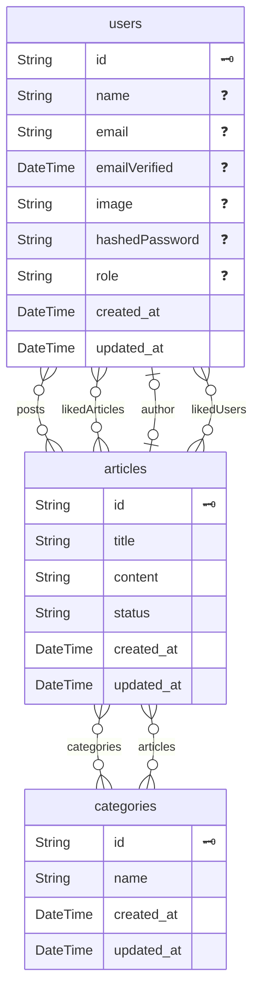

```mermaid
erDiagram

  "users" {
    String id "🗝️"
    String name "❓"
    String email "❓"
    DateTime emailVerified "❓"
    String image "❓"
    String hashedPassword "❓"
    String role "❓"
    DateTime created_at 
    DateTime updated_at 
    }
  

  "articles" {
    String id "🗝️"
    String title 
    String content 
    String status 
    DateTime created_at 
    DateTime updated_at 
    }
  

  "categories" {
    String id "🗝️"
    String name 
    DateTime created_at 
    DateTime updated_at 
    }
  
    "users" o{--}o "articles" : "posts"
    "users" o{--}o "articles" : "likedArticles"
    "articles" o|--|o "users" : "author"
    "articles" o{--}o "users" : "likedUsers"
    "articles" o{--}o "categories" : "categories"
    "categories" o{--}o "articles" : "articles"
```
